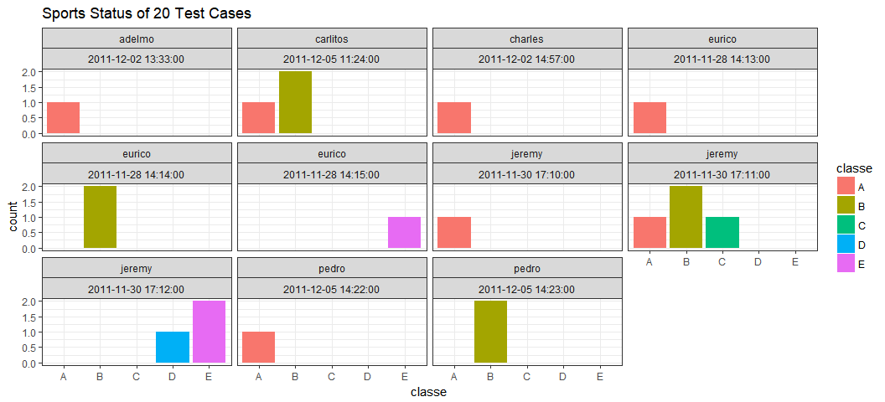

# PML-CP-Barbell-Lifts
JackHo  
July 7, 2017  


### Background
Using devices such as Jawbone Up, Nike FuelBand, and Fitbit it is now possible to collect a large amount of data about personal activity relatively inexpensively. These type of devices are part of the quantified self movement – a group of enthusiasts who take measurements about themselves regularly to improve their health, to find patterns in their behavior, or because they are tech geeks. One thing that people regularly do is quantify how much of a particular activity they do, but they rarely quantify how well they do it.    

In this project, I will use data from accelerometers on the belt, forearm, arm, and dumbell of 6 participants. They were asked to perform barbell lifts correctly and incorrectly in 5 different ways.    

### Goals
The goal of this project is to **predict the manner in which they did the exercise**， which can be represented by the `classe` variable in the training set. The categories in the `classe` variable are listed below:    

- Class A: exactly according to the specification    
- Class B: throwing the elbows to the front    
- Class C: lifting the dumbbell only halfway    
- Class D: lowering the dumbbell only halfway    
- Class E: throwing the hips to the front

In this report, I will describe:    

- how I built my model   
- how I used cross validation   
- what I think the expected out of sample error is    
- and why I made the choices I did    
- I will also use my prediction model to predict 20 different test cases

### Load Packages

```r
options(scipen = 999)
library(data.table)
library(dplyr)
library(caret)
library(rpart)
library(parallelRandomForest)
library(ggplot2)
library(VIM)
library(rpart.plot)
library(gbm)
library(parallel)
library(caretEnsemble)
```

### Load dataset

```r
trainSource <- fread(input = "./pml-training.csv", sep = ",", header = T, stringsAsFactors = F, verbose = F, 
      encoding = "UTF-8") %>% select(-V1, -3, -4)
trainSource[trainSource == "", ] <- NA
trainSource[trainSource == "#DIV/0!", ] <- NA

testCases <- fread(input = "./pml-testing.csv", sep = ",", header = T, stringsAsFactors = F, verbose = F, 
      encoding = "UTF-8") %>% select(-V1, -3, -4)
testCases[testCases == "", ] <- NA
testCases[testCases == "#DIV/0!", ] <- NA
```


### Exploratory Analysis

The time for each participant took the test usually lasts  for 2 or 3 minutes. At the first minute, all participants did the same activity-- **class A** (*exactly according to the specification*). In the last minute, 6 participants lowered the dumbell only halfway (**class D**), and except Eurico, all the other people threw the hips to the front (**class E**).


The original data set has 19622 rows and 156 variables. However, there are 100 variables in the original data set contains missing values. Worse, for variables which have missing values, they all missed more than about 97.98% of observations, and even there are 6 predictors have no recorded values (such predictors should be excluded).


Check the frequency of percentage of NAs corresponding to every predictors below:

```r
data.frame(PercentNAs = as.numeric(as.character((table(var_tb$PercentNAs) %>% t() %>% as.data.frame() %>% 
      select(Var2))[, 1])), Freq = as.numeric(as.character((table(var_tb$PercentNAs) %>% t() %>% as.data.frame() %>% 
      select(Freq))[, 1]))) %>% arrange(PercentNAs) %>% head() %>% knitr::kable()
```


 PercentNAs   Freq
-----------  -----
  0.0000000     57
  0.9793089     67
  0.9793599      1
  0.9794109      1
  0.9795128      1
  0.9795638      4

It shows that among the predictors which have NAs, the lowest percentage of NAs is about 98% (about 19230 obs of all 19622 obs are NAs in such predictors), which means **such predictors could be dropped directly and no need to impute them at all** (the picture below shows the data set without predictors which have large number of missing values).


### Data Splitting

```r
set.seed(1234)
# time does not need to be considered here
trainSource <- trainSource %>% select(-time)
trainSource$classe <- as.factor(trainSource$classe)
inTrain <- createDataPartition(y = trainSource$classe, p = 0.6, list = F)
training <- trainSource[inTrain, ]
valtesting <- trainSource[-inTrain, ]
inValiTest <- createDataPartition(y = valtesting$classe, p = 0.5, list = F)
validation <- valtesting[inValiTest, ]
testing <- valtesting[-inValiTest, ]
# dim(training)
# dim(validation)
# dim(testing)
```
Now I have a training set with 11776 observations, a validation set with 3923 observations and a testing set with 3923 observations. The validation set will be used to help me select the best model. The test set will be used to test the accuracy of the final model I selected.

### Build Models

- Decision Tree

```r
# cross validation
controls <- trainControl(method = "cv", number = 10)
modelFit_dt <- train(x = training[, 1:53], y = training[, 54],  method = "rpart", 
      trControl = controls)
rpart.plot(modelFit_dt$finalModel)
```


```r
pred_dt <- predict(modelFit_dt, newdata = validation)
confusionMatrix(pred_dt, validation$classe)$overall[1]
```

```
##  Accuracy 
## 0.4878919
```
The decision tree model shows that when apply the model on the validation set, the accuracy will be about 0.4878919. And `class D` is extremely badly classified.

- Gradient Boosting Decision Tree (GBDT)

```r
# cross validation
modelFit_gbm <- train(x = training[, 1:53], y = training[, 54], method = "gbm", trControl = controls, 
      verbose = F, tuneGrid = expand.grid(.n.trees = c(100), .interaction.depth = c(11), .shrinkage = c(0.001), 
            .n.minobsinnode = c(10)))

pred_gbm <- predict(modelFit_gbm, newdata = validation, n.trees = 100, type = "raw")
confusionMatrix(pred_gbm, validation$classe)$overall[1]
```

```
##  Accuracy 
## 0.8353301
```
The GBDT model shows that when apply the model on the validation set,the accuracy will be about 0.8353301.

- Random Forest

```r
# numVars <- ncol(training)-1
# msedf <- data.frame(numVars = 1:numVars, mse = NA)
# for(index in 1:numVars){
#       rfmd <- randomForest(x = training[,1:53],y = training[,54],mtry = numVars,ntree = 5,importantce = TRUE, proximity = TRUE)
#       print(mean(rfmd$err.rate,na.rm = TRUE))
#       msedf[index,2] <- mean(rfmd$err.rate,na.rm = TRUE)
# }
# mtry <- msedf$numVars[which(msedf$mse == min(msedf$mse))]
# rfmd <- randomForest(x = training[,1:53],y = training[,54],mtry = mtry,ntree = 500,importantce = TRUE, proximity = TRUE)
# plot(rfmd)
mtry <- 15
ntree <- 100
# cross validation
controls <- trainControl(method = "cv", number = 10)
modelFit_rf <- train(x = training[, 1:53], y = training[, 54],  method = "rf", trControl = controls, 
      tuneGrid = expand.grid(.mtry = mtry), ntree = 100)
pred_rf <- predict(modelFit_rf, newdata = validation)
confusionMatrix(pred_rf, validation$classe)$overall[1]
```

```
##  Accuracy 
## 0.9910783
```
The Random Forest model shows that when apply the model on the validation set,the accuracy will be about 0.9910783.

- Stacking

```r
control <- trainControl(method = "cv", number = 10, savePredictions = "final", index = createFolds(y = training$classe, 10))

models <- caretList(classe ~ ., data = training, trControl = control, metric = "Accuracy", tuneList = list(gbm = caretModelSpec(method = "gbm", verbose = F, tuneGrid = expand.grid(.n.trees = 100, .interaction.depth = 11, .shrinkage = 0.001, .n.minobsinnode = 10)), rf = caretModelSpec(method = "rf", tuneGrid = expand.grid(.mtry = mtry), ntree = 100), rpart = caretModelSpec(method = "rpart")))

predRpart <- predict(models$rpart, newdata = validation)
predRf <- predict(models$rf, newdata = validation)
predGbm <- predict(models$gbm, newdata = validation)
predDF <- data.frame(predRpart, predRf, predGbm, classe = validation$classe)
combStack <- train(x = predDF[, 1:3], y = predDF[, 4], method = "rf", trControl = trainControl(method = "cv", 
      number = 10), tuneGrid = expand.grid(.mtry = 2))
confusionMatrix(predict(combStack, predDF), predDF$classe)$overall[1]
```

```
## Accuracy 
## 0.991843
```
After stacking all the models created, it shows that when apply the model on the validation set, the accuracy will be about 0.991843.

### Model Selection
Based on the above research, the stacked model does improve the overall accuracy of the prediction. Thus, I will choose the `stacked model`, which is made of `random forest`, `decision tree` and `GBDT`.

### Test the Model


```r
predRpart <- predict(models$rpart, newdata = testing)
predRf <- predict(models$rf, newdata = testing)
predGbm <- predict(models$gbm, newdata = testing)
predDF <- data.frame(predRpart, predRf, predGbm)
confusionMatrix(predict(combStack, predDF), testing$classe)$overall[1]
```

```
##  Accuracy 
## 0.9900586
```

Apply the random forest model on the testing set, it will give a 0.9900586 accuracy.

### Predict on 20 Test Cases
Now I will apply the model on those new 20 test cases and see what will their activities be predicted.

```r
testCases <- testCases[,which(names(testCases) %in% names(training))]
predRpart <- predict(models$rpart, newdata = testCases)
predRf <- predict(models$rf, newdata = testCases)
predGbm <- predict(models$gbm, newdata = testCases)
predDF <- data.frame(predRpart, predRf, predGbm)
predTest <- predict(combStack, predDF)

predDF <- data.frame(id=testCases_bak$problem_id,user_name=testNames, classe = predTest, time=testCases_bak$time)
ggplot(data = predDF, aes(x = classe, fill = classe)) + geom_bar() + facet_wrap(c("user_name", "time")) + 
      theme_bw() + ggtitle(label = "Sports Status of 20 Test Cases")
```



From the picture above, most of new participants will be involved in `Class A` (exactly according to the specification) and `Class B` (throwing the elbows to the front).   

### Output File
Output the 20-predicted test cases into a file called “opt.csv”.

```r
if(!file.exists("./opt.csv")){
    write.csv(x = predDF, file = "./opt.csv",fileEncoding = "UTF-8",row.names = F)  
}
```
