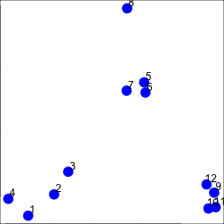

## Exploratory Analysis Content

* Principles of Analytic Graphics
* Exploratory graphs
* Plotting Systems in R
  * base
  * lattice
  * ggplot2
* Hierarchical clustering
* K-Means clustering
* Dimension reduction

---


## Adding a geom


```r
qplot(displ, hwy, data = mpg, geom = c("point", "smooth"))
```


---

## Principles of Analytic Graphics

* Principle 1: Show comparisons
* Principle 2: Show causality, mechanism, explanation
* Principle 3: Show multivariate data
* Principle 4: Integrate multiple modes of evidence
* Principle 5: Describe and document the evidence
* Principle 6: Content is king

---

## K-means clustering -  example


```r
set.seed(1234)
par(mar = c(0, 0, 0, 0))
x <- rnorm(12, mean = rep(1:3, each = 4), sd = 0.2)
y <- rnorm(12, mean = rep(c(1, 2, 1), each = 4), sd = 0.2)
plot(x, y, col = "blue", pch = 19, cex = 2)
text(x + 0.05, y + 0.05, labels = as.character(1:12))
```

 

