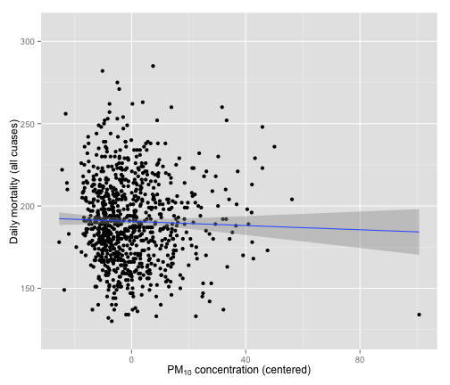
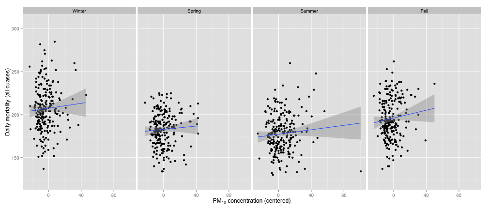

## Principles of Analytic Graphics

* Principle 1: Show comparisons

  - Evidence for a hypothesis is always *relative* to another competing
    hypothesis.

  - Always ask "Compared to What?"

---

## Show Comparisons

 

Reference: Butz AM, *et al.*, *JAMA Pediatrics*, 2011.

---

## Show Comparisons

 

Reference: Butz AM, *et al.*, *JAMA Pediatrics*, 2011.

---

## Principles of Analytic Graphics

* Principle 1: Show comparisons

  - Evidence for a hypothesis is always *relative* to another competing
    hypothesis.

  - Always ask "Compared to What?"

* Principle 2: Show causality, mechanism, explanation, systematic structure 
  - What is your causal framework for thinking about a question?

---

## Show causality, mechanism

 

Reference: Butz AM, *et al.*, *JAMA Pediatrics*, 2011.

---
## Show causality, mechanism

 

Reference: Butz AM, *et al.*, *JAMA Pediatrics*, 2011.

---

## Principles of Analytic Graphics

* Principle 1: Show comparisons

  - Evidence for a hypothesis is always *relative* to another competing
    hypothesis.

  - Always ask "Compared to What?"

* Principle 2: Show causality, mechanism, explanation, systematic structure 
  - What is your causal framework for thinking about a question?

* Principle 3: Show multivariate data
  - Multivariate = more than 2 variables 
  - The real world is multivariate
  - Need to "escape flatland"

---

## Show Multivariate Data

 

---
## Show Multivariate Data

 

---

## Principles of Analytic Graphics

* Principle 4: Integration of evidence
  - Completely integrate words, numbers, images, diagrams

  - Data graphics should make use of many modes of data presentation 

  - Don't let the tool drive the analysis

---

## Integrate Different Modes of Evidence

---

## Principles of Analytic Graphics

* Principle 4: Integration of evidence
  - Completely integrate words, numbers, images, diagrams

  - Data graphics should make use of many modes of data presentation 

  - Don't let the tool drive the analysis

* Principle 5: Describe and document the evidence with appropriate
  labels, scales, sources, etc.

  - A data graphic should tell a complete story that is credible 

---

## Principles of Analytic Graphics

* Principle 4: Integration of evidence
  - Completely integrate words, numbers, images, diagrams

  - Data graphics should make use of many modes of data presentation 

  - Don't let the tool drive the analysis

* Principle 5: Describe and document the evidence with appropriate
  labels, scales, sources, etc.

  - A data graphic should tell a complete story that is credible 

* Principle 6: Content is king

  - Analytical presentations ultimately stand or fall depending on the
    quality, relevance, and integrity of their content

---

## Summary

* Principle 1: Show comparisons
* Principle 2: Show causality, mechanism, explanation
* Principle 3: Show multivariate data
* Principle 4: Integrate multiple modes of evidence
* Principle 5: Describe and document the evidence
* Principle 6: Content is king

---

## References

Edward Tufte (2006). *Beautiful Evidence*, Graphics Press LLC. [www.edwardtufte.com](http://www.edwardtufte.com)
