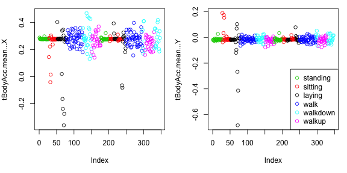
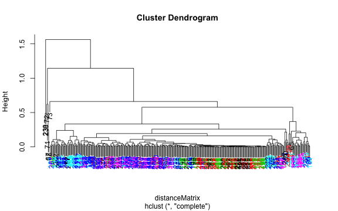
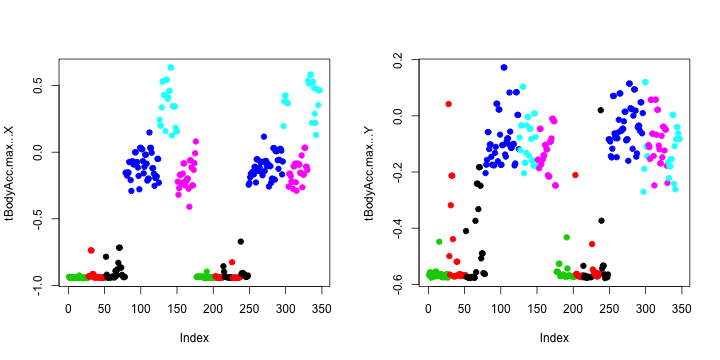
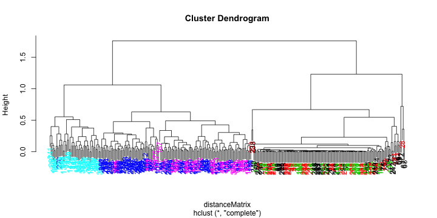
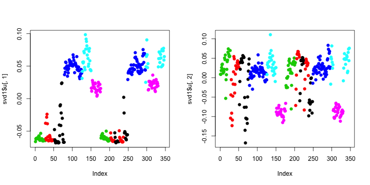
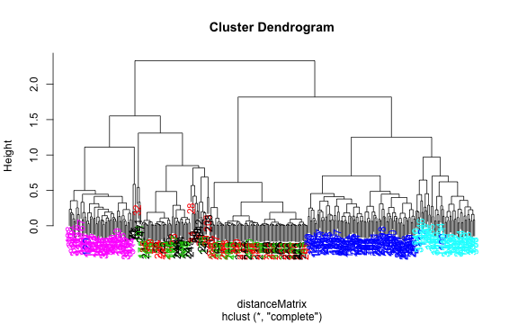

## Samsung Galaxy S3


[http://www.samsung.com/global/galaxys3/](http://www.samsung.com/global/galaxys3/)


---

## Samsung Data


[http://archive.ics.uci.edu/ml/datasets/Human+Activity+Recognition+Using+Smartphones](http://archive.ics.uci.edu/ml/datasets/Human+Activity+Recognition+Using+Smartphones)


---

## Slightly processed data

[Samsung data file]("https://dl.dropboxusercontent.com/u/7710864/courseraPublic/samsungData.rda")


```r
load("data/samsungData.rda")
names(samsungData)[1:12]
```

```
##  [1] "tBodyAcc-mean()-X" "tBodyAcc-mean()-Y" "tBodyAcc-mean()-Z"
##  [4] "tBodyAcc-std()-X"  "tBodyAcc-std()-Y"  "tBodyAcc-std()-Z" 
##  [7] "tBodyAcc-mad()-X"  "tBodyAcc-mad()-Y"  "tBodyAcc-mad()-Z" 
## [10] "tBodyAcc-max()-X"  "tBodyAcc-max()-Y"  "tBodyAcc-max()-Z"
```

```r
table(samsungData$activity)
```

```
## 
##   laying  sitting standing     walk walkdown   walkup 
##     1407     1286     1374     1226      986     1073
```


---

## Plotting average acceleration for first subject


```r
par(mfrow = c(1, 2), mar = c(5, 4, 1, 1))
samsungData <- transform(samsungData, activity = factor(activity))
sub1 <- subset(samsungData, subject == 1)
plot(sub1[, 1], col = sub1$activity, ylab = names(sub1)[1])
plot(sub1[, 2], col = sub1$activity, ylab = names(sub1)[2])
legend("bottomright", legend = unique(sub1$activity), col = unique(sub1$activity), 
    pch = 1)
```

 


---

## Clustering based just on average acceleration

<!-- ## source("http://dl.dropbox.com/u/7710864/courseraPublic/myplclust.R")  -->


```r
source("myplclust.R")
distanceMatrix <- dist(sub1[, 1:3])
hclustering <- hclust(distanceMatrix)
myplclust(hclustering, lab.col = unclass(sub1$activity))
```

 


---

## Plotting max acceleration for the first subject


```r
par(mfrow = c(1, 2))
plot(sub1[, 10], pch = 19, col = sub1$activity, ylab = names(sub1)[10])
plot(sub1[, 11], pch = 19, col = sub1$activity, ylab = names(sub1)[11])
```

 


---

## Clustering based on maximum acceleration


```r
source("myplclust.R")
distanceMatrix <- dist(sub1[, 10:12])
hclustering <- hclust(distanceMatrix)
myplclust(hclustering, lab.col = unclass(sub1$activity))
```

 


---

## Singular Value Decomposition


```r
svd1 = svd(scale(sub1[, -c(562, 563)]))
par(mfrow = c(1, 2))
plot(svd1$u[, 1], col = sub1$activity, pch = 19)
plot(svd1$u[, 2], col = sub1$activity, pch = 19)
```

 


---

## Find maximum contributor


```r
plot(svd1$v[, 2], pch = 19)
```

 


---

##  New clustering with maximum contributer


```r
maxContrib <- which.max(svd1$v[, 2])
distanceMatrix <- dist(sub1[, c(10:12, maxContrib)])
hclustering <- hclust(distanceMatrix)
myplclust(hclustering, lab.col = unclass(sub1$activity))
```

 


---

##  New clustering with maximum contributer


```r
names(samsungData)[maxContrib]
```

```
## [1] "fBodyAcc.meanFreq...Z"
```


---

##  K-means clustering (nstart=1, first try)


```r
kClust <- kmeans(sub1[, -c(562, 563)], centers = 6)
table(kClust$cluster, sub1$activity)
```

```
##    
##     laying sitting standing walk walkdown walkup
##   1      0       0        0   50        1      0
##   2      0       0        0    0       48      0
##   3     27      37       51    0        0      0
##   4      3       0        0    0        0     53
##   5      0       0        0   45        0      0
##   6     20      10        2    0        0      0
```


---

##  K-means clustering (nstart=1, second try)


```r
kClust <- kmeans(sub1[, -c(562, 563)], centers = 6, nstart = 1)
table(kClust$cluster, sub1$activity)
```

```
##    
##     laying sitting standing walk walkdown walkup
##   1      0       0        0    0       49      0
##   2     18      10        2    0        0      0
##   3      0       0        0   95        0      0
##   4     29       0        0    0        0      0
##   5      0      37       51    0        0      0
##   6      3       0        0    0        0     53
```


---

##  K-means clustering (nstart=100, first try)


```r
kClust <- kmeans(sub1[, -c(562, 563)], centers = 6, nstart = 100)
table(kClust$cluster, sub1$activity)
```

```
##    
##     laying sitting standing walk walkdown walkup
##   1     18      10        2    0        0      0
##   2     29       0        0    0        0      0
##   3      0       0        0   95        0      0
##   4      0       0        0    0       49      0
##   5      3       0        0    0        0     53
##   6      0      37       51    0        0      0
```


---

##  K-means clustering (nstart=100, second try)


```r
kClust <- kmeans(sub1[, -c(562, 563)], centers = 6, nstart = 100)
table(kClust$cluster, sub1$activity)
```

```
##    
##     laying sitting standing walk walkdown walkup
##   1     29       0        0    0        0      0
##   2      3       0        0    0        0     53
##   3      0       0        0    0       49      0
##   4      0       0        0   95        0      0
##   5      0      37       51    0        0      0
##   6     18      10        2    0        0      0
```


---

##  Cluster 1 Variable Centers (Laying)


```r
plot(kClust$center[1, 1:10], pch = 19, ylab = "Cluster Center", xlab = "")
```

 


---

##  Cluster 2 Variable Centers (Walking)


```r
plot(kClust$center[4, 1:10], pch = 19, ylab = "Cluster Center", xlab = "")
```

 


