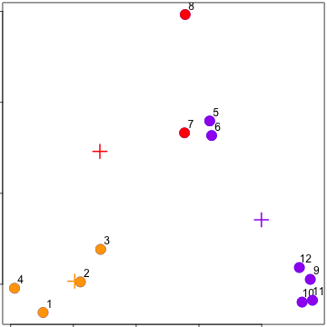
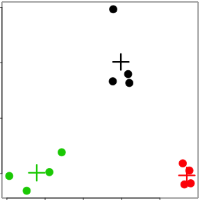
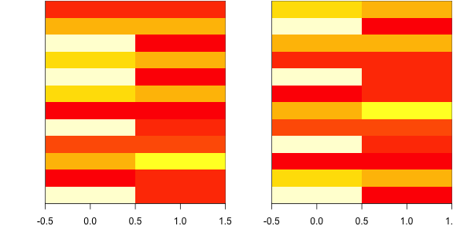

## Can we find things that are close together? 

* How do we define close?
* How do we group things?
* How do we visualize the grouping? 
* How do we interpret the grouping? 


---

## How do we define close?

* Most important step
  * Garbage in $\longrightarrow$ garbage out
* Distance or similarity
  * Continuous - euclidean distance
  * Continous - correlation similarity
  * Binary - manhattan distance
* Pick a distance/similarity that makes sense for your problem
  

---

## K-means clustering

* A partioning approach
  * Fix a number of clusters
  * Get "centroids" of each cluster
  * Assign things to closest centroid
  * Reclaculate centroids
* Requires
  * A defined distance metric
  * A number of clusters
  * An initial guess as to cluster centroids
* Produces
  * Final estimate of cluster centroids
  * An assignment of each point to clusters
  

---

## K-means clustering -  example


```r
set.seed(1234)
par(mar = c(0, 0, 0, 0))
x <- rnorm(12, mean = rep(1:3, each = 4), sd = 0.2)
y <- rnorm(12, mean = rep(c(1, 2, 1), each = 4), sd = 0.2)
plot(x, y, col = "blue", pch = 19, cex = 2)
text(x + 0.05, y + 0.05, labels = as.character(1:12))
```

 


---

## K-means clustering -  starting centroids


 


---

## K-means clustering -  assign to closest centroid

 


---

## K-means clustering -  recalculate centroids

 


---

## K-means clustering -  reassign values

 


---

## K-means clustering -  update centroids

 


---

## `kmeans()`

* Important parameters: _x_, _centers_, _iter.max_, _nstart_


```r
dataFrame <- data.frame(x, y)
kmeansObj <- kmeans(dataFrame, centers = 3)
names(kmeansObj)
```

```
## [1] "cluster"      "centers"      "totss"        "withinss"    
## [5] "tot.withinss" "betweenss"    "size"         "iter"        
## [9] "ifault"
```

```r
kmeansObj$cluster
```

```
##  [1] 3 3 3 3 1 1 1 1 2 2 2 2
```


---

## `kmeans()`


```r
par(mar = rep(0.2, 4))
plot(x, y, col = kmeansObj$cluster, pch = 19, cex = 2)
points(kmeansObj$centers, col = 1:3, pch = 3, cex = 3, lwd = 3)
```

 


---

## Heatmaps


```r
set.seed(1234)
dataMatrix <- as.matrix(dataFrame)[sample(1:12), ]
kmeansObj2 <- kmeans(dataMatrix, centers = 3)
par(mfrow = c(1, 2), mar = c(2, 4, 0.1, 0.1))
image(t(dataMatrix)[, nrow(dataMatrix):1], yaxt = "n")
image(t(dataMatrix)[, order(kmeansObj$cluster)], yaxt = "n")
```

 


---

## Notes and further resources

* K-means requires a number of clusters
  * Pick by eye/intuition
  * Pick by cross validation/information theory, etc.
  * [Determining the number of clusters](http://en.wikipedia.org/wiki/Determining_the_number_of_clusters_in_a_data_set)
* K-means is not deterministic
  * Different # of clusters 
  * Different number of iterations
* [Rafael Irizarry's Distances and Clustering Video](http://www.youtube.com/watch?v=wQhVWUcXM0A)
* [Elements of statistical learning](http://www-stat.stanford.edu/~tibs/ElemStatLearn/)


